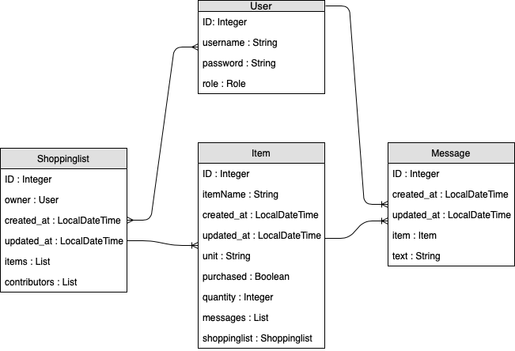

# Bevásárlólista
Ez egy olyan webalkalmazás, ahol a családok vagy egyéb különböző csoportok közösen tarthatják nyilván a megvásárolni szükséges termékeket, azokhoz megjegyzéseket fűzhetnek, elletve új listákat hozhatnak létre.
## Követelményanalízis
### Funkcionális követelmények
A program az alábbi funkciókat valósítja meg:
- regisztráció
- bejelentkezés/kijelentkezés
- profil szerkesztése
- bevásárlólisták listázása: egy bejelentkezett felhasználó látja azokat a bevásárlólistákat, amelyekben szerepel
- új lista létrehozása: egy felhasználó létrehozhat egy új bevásárlólistát, ezáltal az adott lista tulajdonosává válik
- lista törlése: a tulajdonos törölheti az általa létrehozott bevásárlólistát
- tagok hozzáadása a listához: új tagokat lehet hozzárendelni egy adott listához, így számukra is láthatóvá és szerkeszthetővé válik az adott bevásárlólista
- tag eltávolítása a listáról
- termék felvétele: új termék hozzáadása a listához a mennyiség, mértékegység és a termék neve megadásával
- termék törlése
- termék státuszának módosítása: ha egy terméket valaki megvásárolt, ezt jelezheti az alkalmazásban
- megjegyzés írása: a listatagoknak lehetőségük van az egyes termékekhez megjegyzéseket fűzni
### Nem funkcionális követelmények
- felhasználóbarát kinézet, könnyű kezelhetőség
- gyors működés
- biztonságos működés: jelszavak biztonságos tárolása, különböző szerepkörök használata
### Szerepkörök
1. Vendég
- eléri a főodalt, ahol lehetősége van regisztrálni vagy bejelentkezni
2. Bejelentkezett felhasználó
- bejelentkezés után láthatja az adatait, azokat szerkesztheti
- új bevásárlólistát hozhat létre, ezáltal tulajdonossá válik
3. Közreműködő
- az adott bevásárlólista megjelenik az adatlapján, azt megtekintheti
- új terméket vehet fel a listára
- törölhet terméket
- módosíthatja egy termék státuszát
- megjegyzéseket fűzhet a termékekhez
- törölheti magát a lista közreműködői közül
4. Listatulajdonos
- új közreműködőket adhat hozzá a listához felhasználónév megadásával
- eltávolíthat tagokat a közreműködők közül
- törölheti a listát

## Backend megvalósítása

### Fejlesztői környezet

#### Felhasznált eszközök

* [Java](https://www.java.com/) [Spring Boot](https://projects.spring.io/spring-boot/) technológia használata
* [H2](http://www.h2database.com/) adatbázis használata
* [MAVEN](https://maven.apache.org/) a projekt menedzseléséhez és a build folyamat automatizálásához
* [Github](https://github.com/) a projekt közzétételéhez

### Adatbázis-terv

### Könyvtárstruktúra

- main
    - java
        - hu
            - elte
                - shoppinglist
                    - `ShoppinglistApplication.java`
                    - controllers
                        - `ItemController.java`
                        - `MessageController.java`
                        - `ShoppingListController.java`
                        - `UserController.java`
                    - entities
                        - `Item.java`
                        - `Message.java`
                        - `Shopping.java`
                        - `User.java`
                    - repositories
                        - `ItemRepository.java`
                        - `MessageRepository.java`
                        - `ShoppingRepository.java`
                        - `UserRepository.java`
                    - security
                        - `WebSecurityConfig.java`
    - resources
        - `data.sql`
        - `application.properties`

### Végpontok

#### shoppinglist

- `GET /shoppinglist/` : Az összes bevásárlólista lekérdezése
- `GET /shoppinglist/{id}` : Egy bevásárlólista lekérdezése
- `GET /shoppinglist/{id}/item` : Egy bevásárlólista elemeinek lekérdezése
- `POST /shoppinglist/` : Bevásárlólista létrehozása
- `POST /shoppinglist/{id}/item` : Bevásárlólistához elem hozzáadása
- `PUT /shoppinglist/{id}` : Bevásárlólista módosítása
- `DELETE /shoppinglist/{id}` : Bevásárlólista törlése

#### message

- `GET /message/` : Az összes komment lekérdezése
- `GET /message/{id}` : Egy komment lekérdezése
- `POST /message/` : Komment létrehozása
- `PUT /message/{id}` : Komment módosítása
- `DELETE /message/{id}` : Komment törlése

#### item

- `GET /item/` : Az összes termék lekérdezése
- `GET /item/{id}` : Egy termék lekérdezése
- `GET /item/{id}/message` : Egy termék kommentjeinek lekérdezése
- `POST /item/` : Termék létrehozása
- `POST /item/{id}/message` : Termékhez komment hozzáadása
- `PUT /item/{id}` : Termék módosítása
- `DELETE /item/{id}` : Termék törlése

#### user

- `POST /user/register` : Felhasználó hozzáadása
- `POST /user/login` : Bejelentkezés